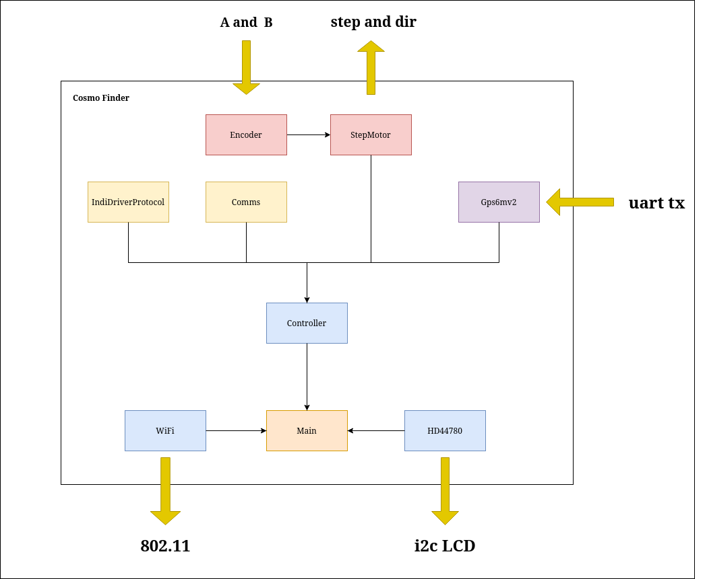

# Cosmo Finder

Projeto de um sistema GoTo para uma base altazimutal do padrão Dobsoniano, desenvolvido com o Kit de Desenvolvimento da ESP32.
***

## Requisitos

É necessário os pacotes básico de desenvolvimento, são eles o *gcc*, *python*. A IDE VSCode, e também é necessário a instalação da extensão PlatformIO.

Caso tenha dúvidas na instalação acesse: https://platformio.org/install

***
## Instalação 
Baixe o repositório e acesse a pasta.

`git clone https://github.com/brunocmo/cosmo-finder.git`

`cd cosmo-finder`

Pode se usar os comandos já fixados pelo VSCode na extensão do platformIO, que já faz a build, upload e monitoramento da placa.

Caso tenha dúvidas de como usar, acesse: https://docs.platformio.org/en/latest/integration/ide/vscode.html#platformio-toolbar

Mas tambeḿ pode ser utilizado os comandos vindos do terminal da Platform IO.
Para fazer a configuração do wifi no menu do programa:

`platformio run -t menuconfig`

Para fazer a build do programa:

`platformio run --environment esp32doit-devkit-v1`

Para carregar o programa na esp32:

`platformio run --target upload --environment esp32doit-devkit-v1`

Para monitorar a esp32:

`platformio device monitor --environment esp32doit-devkit-v1`

***

# Imagens

## Diagrama de blocos do sistema

